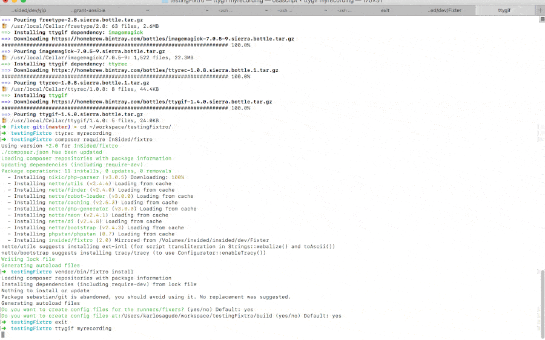

# Fixtro

A tool/framework to fix and check static code analysis in our enviroments. 

90% Users just need to run the install command, install the precommit and thats it, you will have a fixer of the code, and a way to analyze your code so detects possible(or future) errors.
In order to do so execute:
    
    composer require karlosagudo/fixtro
 
    vendor/bin/fixtro install

## Usage:

    {vendor-bin}/fixtro
    
In order to install:

    {vendor-bin}/fixtro install    

This will install fixtro dependencies and it as a precommit hook.

This is the command will be executed in each precommit:
    
    {vendor-bin}/fixtro precommit
         
If want more info about the processes use verbose option -vvv

**Fixtro** uses local binaries in case it found it, (for example phpunit, phpmd, php-cs-fixer),
 but in case it doesnt find it, it uses the own from fistro. (Thats why the install run a composer inside the vendor folder)
 
With this special feature, **there is no need to install anymore php-cs-fixer, phpunit etc in new projects**, only need to install fixtro on it.
Also , fixtro will try to look for local config files ie: .php_cs, phpunit.xml , inside the root folder of your project or the build one.
So, if you want to configure the project just think, as is php_cs_fixer, or phpunit were installed on it.

**Requisites**
* Php 7.0+
* Composer

**Important**
Read the section about Uncomfortable errors, and [generate your own config files](docs/configFile.md)
(.php_cs, phpunit.xml, psalm.xml, phpmd.xml)
(TODO: this files will be generated in the install)
You can put this files, in the root of your project, or in the build folder.
         
### Commands
Are in the folder src/CodeQualityTool/Commands.
There is a general Abstract called GeneralCommand, that normal commands will heritage.

Examples:
- FixEntireCommand - Will run all the checkers across the whole project
- FIxPreCommit- Its intended to be a git-hook precommit, so will analyze only precommited files. (Will ignore the config for src folder and execute in commited files)

All Commands have an array where you can put the analyzers,
and filter by files (folder FilterFiles), and add extra parameters.
This analyzers are in the Checker folder.

### Checkers
Checkers are the fixers or checkers that run in each commit and are already configured to be used in fixtro
[List of Checkers](docs/checkers.md)

### Uncomfortable errors

Some of the checkers will show possible errors, that are almost impossible to solve, or there is no need to lost time on it, but you still want to run the other checkers.

This usually happens on phpmd and psalm.
You can configure your own configuration files for this projects, or avoid errors with annotations on the code:
- [Phpmd conf](https://phpmd.org/documentation/writing-a-phpmd-rule.html)
- [Phpmd avoid errors](https://phpmd.org/documentation/suppress-warnings.html)
- [Psalm conf](https://github.com/vimeo/psalm/wiki/Configuration)
- [Psalm avoid errors](https://github.com/vimeo/psalm/wiki/Dealing-with-code-issues)

You can also avoid errors, using a listener in your project. Check next section

### Control Fixtro in your own project
[Using events](docs/events.md)

### Config File Reference
[Config fixtro.yml Reference](docs/configFile.md)

#####TODO:
- allow to generate your own runner in the config
- Tests, create a fake fixer test command, to add coverage
- Checker of phpunit and phpspec if the project has defined a spec folder / phphunit

